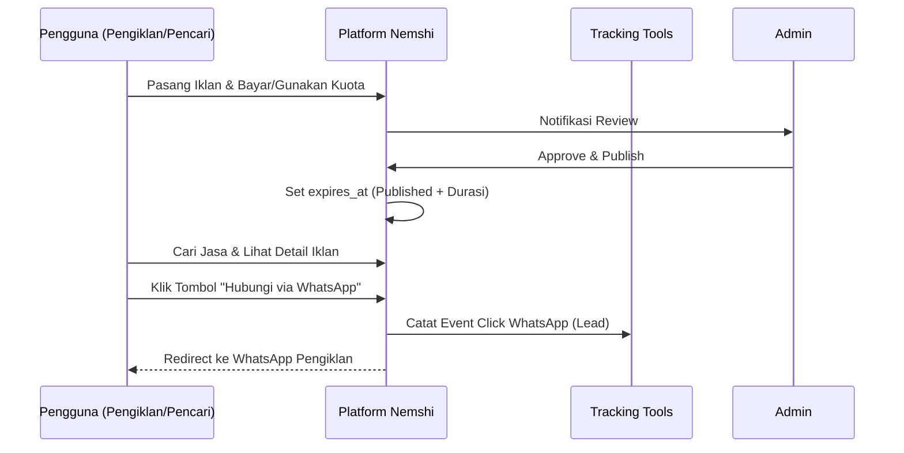
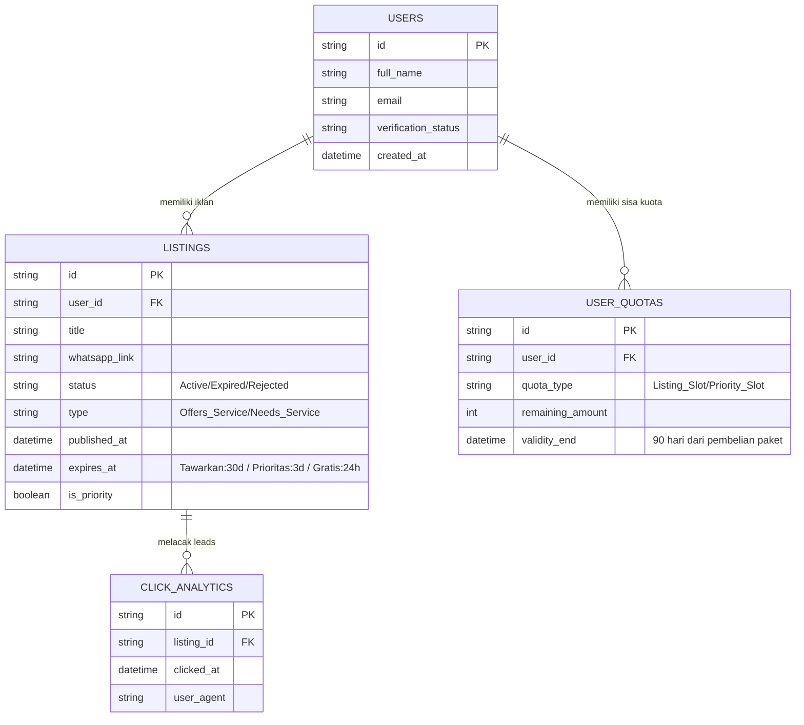

# PRD — Project Requirements Document (v19)

## 1. Overview
**Nemshi** (berarti "ayo jalan") adalah platform direktori iklan jasa (Job Directory/Classified Ads) khusus untuk mahasiswa Indonesia di Mesir (Masisir). Saat ini, informasi mengenai penyedia jasa di kalangan Masisir berserakan di grup-grup WhatsApp, tidak terstruktur, sulit dicari, dan tidak memiliki wadah promosi yang profesional. Di sisi lain, para penyedia jasa (freelancer, tutor, UMKM) kesulitan mempromosikan layanan mereka dengan tampilan yang rapi dan jangkauan yang terukur.

Nemshi hadir sebagai wadah tunggal yang menghubungkan pelanggan dengan penyedia jasa melalui direktori iklan terorganisir. Berbeda dengan marketplace transaksi, Nemshi berfungsi sebagai jembatan komunikasi. Pelanggan dapat mencari jasa berdasarkan kategori, melihat profil pengiklan, dan langsung terhubung ke WhatsApp penyedia. Seluruh negosiasi, kesepakatan harga, pelaksanaan pekerjaan, dan pembayaran dilakukan secara mandiri di luar platform.

Model bisnis Nemshi berbasis pada penjualan ruang promosi (exposure) dan fitur berbayar. Sumber pendapatan utama berasal dari:
- **Iklan Tawarkan Jasa:** Biaya publikasi Rp50.000 per iklan jasa untuk masa tayang 30 hari.
- **Cari Jasa Gratis:** Gratis, maksimal 1× per 30 hari, tayang selama 24 jam (Job Posting).
- **Cari Jasa Prioritas:** Rp12.000 agar permintaan tampil menonjol (pin to top) selama 3 hari.
- **Paket Plus:** Rp150.000 untuk 3 kuota Tawarkan Jasa dan 2 kuota Cari Jasa Prioritas, berlaku 90 hari.
- **Traktir Platform:** Donasi sukarela Rp5.000 sebagai apresiasi setelah pengguna berhasil menemukan jasa atau pelanggan.

Platform tetap gratis diakses oleh pencari jasa untuk melihat iklan dan memasang permintaan standar. Untuk memastikan kualitas dan keamanan komunitas, setiap iklan dan permintaan melalui proses moderasi admin sebelum ditayangkan. Fokus awal dibatasi pada maksimal tiga kategori jasa prioritas: Jasa Titip/Antar, Pindahan, dan Jasa Akademik/Penerjemahan.

## 2. Requirements
- **Target Pengguna:** Mahasiswa (baru dan aktif), organisasi, alumni, keluarga, serta penyedia jasa/pengiklan (freelancer, tutor, kreator digital, pemilik kendaraan, UMKM).
- **Model Bisnis (Iklan Berbayar):** Platform menghasilkan pendapatan dari biaya publikasi iklan tetap, bukan komisi transaksi. Pelacakan pendapatan mencakup penjualan kuota Paket Plus, biaya iklan satuan, dan donasi sukarela.
- **Batasan Tanggung Jawab:** Platform murni sebagai direktori iklan. Platform tidak menangani pemesanan (booking), pengelolaan jadwal, pembayaran jasa, escrow, maupun penyelesaian sengketa pekerjaan. Tidak tersedia fitur chat in-app, wallet, atau sistem transaksi jasa. Platform hanya menjual ruang iklan dan exposure. Semua komunikasi dilakukan langsung melalui WhatsApp.
- **Manajemen Ekspektasi:** Platform menjamin exposure (tampilan dan klik) yang terukur, tetapi tidak menjamin terjadinya kesepakatan kerja. Informasi ini harus ditampilkan di halaman pembuatan iklan.
- **Transparansi Kepercayaan:** Sistem verifikasi pengiklan (identitas, keahlian, pengalaman) tetap dipertahankan. Testimoni diberikan pada profil pengiklan untuk membangun reputasi berdasarkan interaksi luar platform.
- **Kurasi Iklan:** Setiap iklan dan permintaan jasa harus diperiksa manual oleh admin untuk memastikan informasi jelas dan aman sebelum ditayangkan.
- **Keamanan Platform & Anti-Spam:**
  - Fitur pelaporan disediakan agar pengguna dapat melaporkan iklan mencurigakan.
  - Nomor kontak WhatsApp disembunyikan di balik tombol "Hubungi via WhatsApp" untuk mencegah scraping massal.
  - Validasi ketat pada posting "Cari Jasa Gratis" untuk mencegah spam, termasuk pembatasan frekuensi 1× per 30 hari.
- **Strategi Harga Promosi & Traksi Awal:** Platform dapat menyediakan opsi masa percobaan gratis untuk membuktikan klik WhatsApp sebelum pengiklan dikenakan biaya penuh.
- **Aksesibilitas:** Aplikasi responsif dan ringan (Next.js) dengan integrasi tracking klik yang akurat.
- **Metrik Keberhasilan:** Diukur dari jumlah klik tombol WhatsApp (Lead Generation), jumlah iklan aktif, penjualan Paket Plus, dan tingkat perpanjangan iklan.
- **Kebijakan Pengembalian Dana (Publikasi IP):** Biaya iklan dikembalikan jika konten ditolak admin sebelum tayang. Jika sudah tayang, biaya tidak dapat dikembalikan.

## 3. Core Features

### Fase 1: Direktori Iklan, Galeri Penemuan & Paket Kuota
- **Jelajahi Iklan Jasa (Galeri Penemuan)** — Antarmuka katalog untuk menemukan berbagai iklan penawaran jasa secara terstruktur.
  - Cari & Filter: Temukan iklan berdasarkan kata kunci, kategori, atau area.
  - Galeri Iklan: Tampilan thumbnail yang mencantumkan judul, profil, dan label harga.
  - Detail Iklan: Deskripsi mendalam, 5 foto portofolio, dan **Tombol Hubungi via WhatsApp**.
  - Opsi Harga: Pengiklan dapat menampilkan kisaran harga atau label "Hubungi untuk Harga".
- **Pasang Iklan Tawarkan Jasa** — Alur mandiri: Input data iklan -> Bayar/Gunakan Kuota -> Moderasi Admin -> Tayang 30 Hari.
- **Cari Jasa (Job Posting)** — Publikasi kebutuhan oleh pencari jasa (sayembara singkat).
  - Posting Gratis: 1× per 30 hari, durasi tayang 24 jam.
  - Posting Prioritas: Rp12.000, durasi tayang 3 hari dengan posisi menonjol (Priority Label).
- **Paket Plus** — Bundle hemat Rp150.000 (3 Kuota Iklan Tawarkan Jasa + 2 Kuota Cari Jasa Prioritas) masa berlaku kuota 90 hari.

### Fase 2: Pembayaran Publikasi, Reputasi & Verifikasi
- **Sistem Pembayaran Publikasi** — Gateway digital untuk pembelian slot iklan, paket kuota, dan fitur prioritas.
- **Reputasi Pengiklan (Testimoni Profil)** — Pengunjung dapat memberikan testimoni pada profil pengiklan untuk membangun kredibilitas.
- **Profil & Verifikasi** — Lencana "Identitas Terverifikasi" dan "Keahlian Terverifikasi" bagi pengiklan yang telah divalidasi manual.
- **Traktir Platform** — Tombol donasi sukarela Rp5.000 sebagai bentuk apresiasi pengembangan layanan direktori.

### Fase 3: Analitik Exposure & Keamanan
- **Analitik Exposure (Dashboard Pengiklan)** — Dasbor bagi pengiklan untuk melihat performa iklan:
  - Jumlah tayangan iklan (Impressions).
  - **Jumlah Klik Tombol WhatsApp** (Leads).
  - Data waktu klik terakhir.
- **Keamanan Komunitas** — Tombol lapor iklan dan kebijakan suspend akun pengiklan untuk pelanggaran berat.

### Fase 4: Dashboard Operasional Admin
- **Manajemen Moderasi Konten** — Antrean review iklan dan posting "Cari Jasa" sebelum tayang ke publik.
- **Manajemen Kategori & Refund** — Alat mengelola kategori jasa dan proses pengembalian biaya publikasi jika iklan ditolak.
- **Dashboard Laporan Bisnis** — Metrik pertumbuhan: total pendapatan iklan, rata-rata klik WA, dan rasio perpanjangan iklan.

## 4. User Flow

### Alur Tawarkan Jasa (Pengiklan/Penyedia)
1. **Masuk/Daftar:** Pengguna masuk ke akun Nemshi.
2. **Pasang Iklan:** Mengisi form iklan (judul, deskripsi, 5 foto portofolio, lokasi, link WhatsApp).
3. **Pilih Sumber Bayar:** Membayar Rp50.000 atau menggunakan 1 kuota dari Paket Plus.
4. **Bayar Publikasi:** Transaksi deposit biaya iklan diproses via gateway. Status: "Menunggu Moderasi".
5. **Moderasi:** Admin memeriksa kelayakan isi iklan.
6. **Tayang:** Iklan diterbitkan dan aktif secara publik selama 30 hari.
7. **Navigasi WhatsApp:** Calon pelanggan melihat iklan dan mengklik "Hubungi via WhatsApp".
8. **Pantau Leads:** Pengiklan memantau jumlah klik WA di dasbor sebagai bukti efektivitas iklan.

### Alur Cari Jasa (Pencari Jasa)
1. **Buat Posting:** Mengisi form kebutuhan jasa. Pilih Gratis (maks. 1×/30 hari) atau Prioritas (Rp12.000).
2. **Moderasi:** Admin menyetujui konten agar bebas spam.
3. **Tayang:** Posting muncul di papan permintaan (24 jam untuk gratis, 3 hari untuk prioritas).
4. **Respon:** Pengiklan jasa yang relevan melihat posting dan langsung menghubungi WhatsApp pencari.
5. **Traktir:** Pencari memberikan donasi sukarela jika berhasil menemukan penyedia lewat platform.

## 5. Architecture
Platform menggunakan arsitektur Klien-Server yang dioptimalkan untuk performa direktori tanpa fitur chat atau booking in-app.

## 6. Database Schema
Skema relasional yang mendukung manajemen durasi tayang iklan dan kuota paket secara ketat.

## 7. Tech Stack
- **Frontend:** Next.js (React) untuk SEO katalog iklan dan performa ringan.
- **Styling:** Tailwind CSS & shadcn/ui.
- **Backend/ORM:** Drizzle ORM.
- **Database:** Supabase (PostgreSQL) untuk stabilitas data analitik leads dan relasi kuota.
- **Tracking Tools:** Custom Click Tracker untuk menghitung klik tombol WhatsApp.
- **Payment Gateway:** Midtrans atau Xendit (Untuk pembayaran biaya publikasi iklan).
- **Storage:** Cloudinary (Portofolio gambar iklan).
- **Autentikasi:** Supabase Auth terintegrasi.
- **Deployment:** Vercel (Next.js serverless functions & edge caching).

### Performance & Optimization Standards
- **Optimasi Gambar**: Setiap iklan maksimal 5 gambar. Gambar otomatis dikompres ke WebP/AVIF via CDN Cloudinary.
- **Core Web Vitals**: Target LCP < 2,5 detik dengan SSR/SSG Next.js.
- **Minimalisir JavaScript**: Penggunaan library hanya yang esensial untuk fungsi direktori.
- **Caching**: Vercel Edge Network untuk cache halaman direktori iklan.

### Animation & Interactivity
- **Metode**: Animasi halus menggunakan Framer Motion (fade-in kartu iklan, transisi filter).
- **Optimasi**: Hanya menggunakan properti `transform` dan `opacity` untuk menjaga frame rate.

### Design System (Nemshi Identity)
- **Font:** Plus Jakarta Sans (400–800).
- **Palet Warna:**
  - Primary: `#05668D` (Tombol utama, Badge Verifikasi, Navigasi).
  - Background: `#FFFFFF` (Kesan bersih dan ringan).
  - Text: `#102A36` (Utama) dan `#647780` (Sekunder).
- **UI Principles**: Sudut membulat moderat (`rounded-xl`), ruang putih (white space) yang luas, dan kartu iklan yang bersih tanpa distraksi berlebihan.

## 8. Catatan Tambahan
- **Hapus Fitur Marketplace:** Segala bentuk fitur pemesanan, jadwal, sengketa, dan chat internal tidak dikembangkan. Platform fokus 100% sebagai penghubung ke WhatsApp.
- **Ketentuan Durasi Tayang:** Durasi dikunci secara sistem sejak admin memberikan persetujuan (Approve).
- **Kebijakan Iklan:** Iklan yang melanggar norma atau ketentuan hukum akan dihapus tanpa pengembalian dana (setelah tayang).